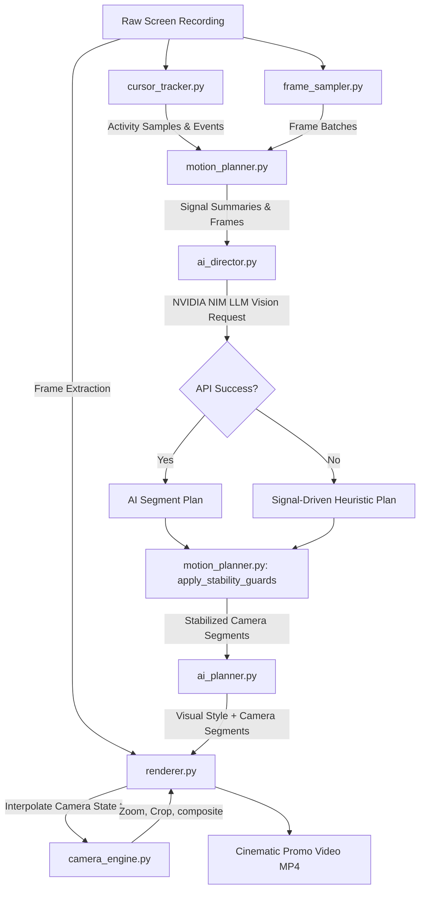

# 🎬 OpenVid AI — Autonomous Cinematic Demo Engine

**OpenVid AI** is an autonomous SaaS-style video editing and camera directing engine. It takes raw screen recordings of software interfaces and automatically transforms them into premium, high-quality cinematic product promos.

By combining classical computer vision (for dense activity tracking and UI analysis) with vision-based LLMs (NVIDIA NIM, Llama-3.2-11b-vision-instruct), OpenVid AI acts as an automated "camera director"—identifying user activity, framing modals, panning smoothly, adding device mockups, custom gradients, and captions, and rendering the final output to a production-ready 1080p video.

---

## 📐 System Pipeline



---

## ⚡ Core Features

*   **Classical CV Signal Extraction**: Continuous optical flow estimation, frame differencing, and vertical scroll correlation trace dense mouse/scroll activity across the timeline.
*   **Semantic Scene Analysis**: Detects UI structure like centered modal/dialog screens, content panel grids, text density maps, and opportunistic OCR (via Tesseract).
*   **AI Vision Director**: Groups sampled video frames into chronological sequences, summarizing detected CV activity for the NVIDIA NIM Llama 3.2 vision model to direct camera pans, zooms, and holds.
*   **Timeline Stability Guards**: Auto-resolves overlapping directives, filters out microscopic camera shakes (segment durations < 0.6s), and damps excessive zoom-level changes.
*   **Continuous Inertia & Easing**: Computes camera position and scale using smooth easing curves (`easeInOutCubic`, `easeOutQuart`, etc.) and blends entry states with previous exit states to prevent jump-cuts.
*   **Graceful Degradation**: If NVIDIA NIM calls are rate-limited, fail, or lack an API key, the planner automatically falls back to a signal-driven classical heuristic engine.
*   **Premium Web UI**: A clean drag-and-drop dashboard to upload, process, monitor rendering stages, and download final media.

---

## 📂 Project Architecture

The codebase is split into modular components for tracking, planning, interpolating, and rendering:

| Component | File Path | Primary Responsibility |
| :--- | :--- | :--- |
| **Server / Entry** | [app.py](file:///d:/video-generator-ai/video-generator/app.py) | Flask web application exposing file uploads, processing pipelines, and JSON plan previews. |
| **Style & Timeline Orchestrator** | [ai_planner.py](file:///d:/video-generator-ai/video-generator/ai_planner.py) | Directs style choices (gradients, mockup dark/light frames) and delegates camera work to the motion planner. |
| **Central Config** | [camera_config.py](file:///d:/video-generator-ai/video-generator/camera_config.py) | Centralized, environment-aware parameters governing zoom bounds, tracker weights, and AI batching. |
| **Activity Tracker** | [cursor_tracker.py](file:///d:/video-generator-ai/video-generator/cursor_tracker.py) | Extracts mouse movement, click points, scroll velocity, and pauses via frame differencing & optical flow. |
| **Scene Analyzer** | [scene_analyzer.py](file:///d:/video-generator-ai/video-generator/scene_analyzer.py) | Performs layout contour matching to locate modals, panels, and text-dense content overlays. |
| **Keyframe Sampler** | [frame_sampler.py](file:///d:/video-generator-ai/video-generator/frame_sampler.py) | Decimates, crops, and JPEG-compresses video frame sequences into size-compliant chronological batches. |
| **AI Director Interface** | [ai_director.py](file:///d:/video-generator-ai/video-generator/ai_director.py) | Generates structured markdown prompts and coordinates schema-compliant vision requests to NVIDIA NIM. |
| **Motion Orchestration & Guards** | [motion_planner.py](file:///d:/video-generator-ai/video-generator/motion_planner.py) | Compiles frame plans, applies heuristic fallbacks, and executes global stabilization / de-overlapping. |
| **Interpolation Engine** | [camera_engine.py](file:///d:/video-generator-ai/video-generator/camera_engine.py) | Evaluates easing curves and blends consecutive segments with camera inertia hand-offs. |
| **Video Compositor** | [renderer.py](file:///d:/video-generator-ai/video-generator/renderer.py) | Applies mockup chrome shell, backgrounds, cropped zoom frames, and subtitles using MoviePy/Pillow. |

---

## 🚀 Setup & Installation

### Prerequisite Dependencies

1.  **Python 3.10+**
2.  **FFmpeg** (required system-wide for MoviePy rendering)
    *   **macOS**: `brew install ffmpeg`
    *   **Linux**: `sudo apt install ffmpeg`
    *   **Windows**: Download binaries from [ffmpeg.org](https://ffmpeg.org/download.html) and append the bin folder to your System `PATH`.
3.  **Tesseract OCR** (*Optional* — for enhanced captioning/semantic understanding)
    *   **macOS**: `brew install tesseract`
    *   **Linux**: `sudo apt install tesseract-ocr`
    *   **Windows**: Install from the UB Mannheim repository and add to system Path.

### Step 1: Create a Virtual Environment & Install Requirements

Activate your python environment and pull the package requirements:

```bash
# Set up venv
python -m venv venv

# Activate venv
# On Windows (PowerShell):
venv\Scripts\Activate.ps1
# On Linux/macOS:
source venv/bin/activate

# Install requirements
pip install -r requirements.txt
```

### Step 2: Configure Environment Credentials

1.  Visit the [NVIDIA API Catalog](https://build.nvidia.com).
2.  Log in or sign up for a free developer account (which includes free NIM credits).
3.  Navigate to a vision model (e.g. `meta/llama-3.2-11b-vision-instruct`).
4.  Generate and copy your **NVIDIA API Key** (`nvapi-...`).
5.  Create a `.env` file in the project root:

```bash
cp .env.example .env
```

Add your API Key:

```env
NVIDIA_API_KEY=nvapi-your-actual-copied-nvidia-key
```

> [!NOTE]
> If `NVIDIA_API_KEY` is omitted, the application will degrade gracefully and run the signal-driven heuristics plan to render camera tracks, meaning you can still fully run the app locally without any API key setup.

### Step 3: Launch the Server

Run the Flask application:

```bash
python app.py
```

Open your browser to **http://localhost:5000**.

---

## ⚙️ Advanced Pipeline Configuration

You can customize camera behaviors, tracking metrics, and processing speeds by tweaking variables inside `camera_config.py` or overriding them directly in your `.env` file.

### Available Tuning Knobs

| Env Variable Name | Default Value | Description |
| :--- | :---: | :--- |
| `CAM_MIN_ZOOM` | `1.0` | Minimum zoom multiplier (base size). |
| `CAM_MAX_ZOOM` | `4.5` | Maximum zoom multiplier (tight focus). |
| `CAM_PAN_SPEED` | `1.0` | Global multiplier adjusting transition duration (higher = faster pan). |
| `CAM_TRACK_SENS` | `0.6` | `0..1` sensitivity weight for chasing cursor movement. |
| `CAM_CURSOR_INFLUENCE` | `0.55` | Percentage weight of cursor coordinate position on focus point. |
| `CAM_SCENE_INFLUENCE` | `0.45` | Percentage weight of CV-detected semantic features on focus point. |
| `CAM_SMOOTHING` | `0.35` | `0..1` smoothing modifier (higher = slower camera adjustments). |
| `CAM_INERTIA` | `0.25` | Friction damping coefficient at segment boundaries to prevent jump cuts. |
| `CAM_MIN_SEG_DUR` | `0.6` | Minimum length of camera action segments in seconds. |
| `CAM_MAX_ZOOM_DELTA` | `2.5` | Maximum zoom scale jump allowed between consecutive segments. |
| `CAM_SAMPLE_FPS` | `6.0` | Frame-rate at which local OpenCV mouse / activity tracking is analyzed. |
| `CAM_PLANNING_FPS` | `2.0` | Sampling rate of frames packaged and sent to the LLM vision director. |
| `CAM_AI_CONTEXT_WINDOW` | `8` | Maximum number of frames sent per single AI vision batch call. |
| `CAM_MAX_BATCHES` | `6` | Upper limit on vision API calls per video to prevent rate limit issues. |
| `CAM_MODAL_AREA_RATIO` | `0.18` | Proportion of screen area required to register a centered modal card. |

---

## 🗃️ Camera Segment JSON Schema

The underlying orchestrator expects segments containing instructions for camera frame manipulation. Below is an example payload representing a single segment in the timeline:

```json
{
  "startTime": 1.5,
  "endTime": 3.8,
  "action": "zoom_in",
  "focusX": 75.4,
  "focusY": 28.1,
  "movementEnabled": true,
  "movementEndX": 75.4,
  "movementEndY": 28.1,
  "zoomLevel": 3.2,
  "panDirection": "none",
  "easing": "easeInOutCubic",
  "transitionType": "smooth",
  "importance": 0.8,
  "confidence": 0.9,
  "reasoning": "Cursor clicked the settings button in the top right header panel",
  "source": "ai"
}
```

---

## 🛠️ Troubleshooting

| Issue / Symptom | Probable Cause | Action / Resolution |
| :--- | :--- | :--- |
| `ModuleNotFoundError: No module named 'moviepy'` | Running outside virtual env | Activate your virtual environment with `source venv/bin/activate` before executing app commands. |
| `OSError: [Errno 2] No such file or directory: 'ffmpeg'` | System FFmpeg missing | Follow the instructions in the Prerequisite section to install FFmpeg and link it to your system PATH. |
| **All plans return static fallbacks** | Missing NVIDIA Credentials | Verify that your `.env` file contains a correct, non-empty `NVIDIA_API_KEY` starting with `nvapi-`. |
| **500 Server Error on rendering** | Temp directories missing | Check the console log. Flask handles auto-creating `uploads/` and `output/`, check system write permissions if blocked. |
| **Upload failure or crash** | Video file too large | By default, Flask caps files at 200MB. Increase the `MAX_CONTENT_LENGTH` inside [app.py](file:///d:/video-generator-ai/video-generator/app.py) if dealing with longer raw recordings. |
| `pytesseract.TesseractNotFoundError` | Tesseract binary missing | The application degrades gracefully if `pytesseract` can't find Tesseract. If you want OCR, install Tesseract and check its path. |

---

## 📜 Static Asset overrides

Drop specific filenames into an `assets/` directory inside the project root to substitute the defaults:
*   `background.mp4` — Substitutes default gradient styling with a looping background video canvas.
*   `cursor.png` — Overrides cursor graphics.
*   `music.mp3` — Overlay background music on top of screen audio during composition.
